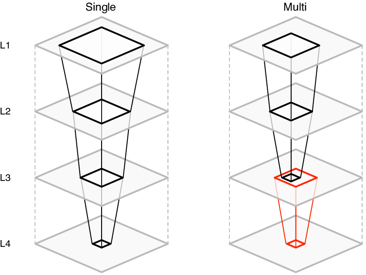

### Title
CNN Acceleration with Layer Fusion on GPU
### Team
* Lawrence Lo
* Eshita Shrawan

### URL
<https://chihyanl.github.io/15418_proj/>
### Summary
We are going to implement CNN with layer fusion on NVIDIA GPU. The project's goal is to port the original FPGA implementation to an NVIDIA GPU implementation.
### Background
Conventional convolution layer has results stored locally and written to the memory at the end of each tile. This requires many memory inferences, which are limited by the memory bandwidth and hinders scalability. Layer fusion attempts to reduce the number of memory inferences by storing tiles of intermediate data to higher-level storage units, instead of inferencing the global memory. With layer fusion, the memory bandwidth requirement and scalability issue can be alleviated.

Layer fusion uses tiles of blocked kernels to form a pyramid. By using the outputs of the first few layers immediately reduces the need to store/read them from the memory. However, with the pyramid structure, there are overlapping intermediate data used by different tiles. These intermediate data can either be recomputed or reused, each having their own trade-off. Recomputing is a simple approach but requires more operations, whereas reusing avoids the extra computation but requires more local storage.

  

